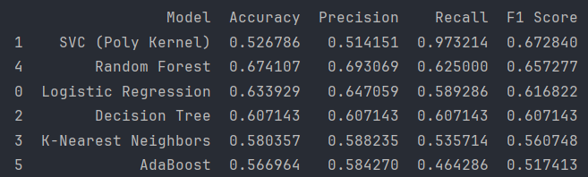

# 🏢 Employee Turnover Prediction

This project develops a **predictive model for employee turnover** using machine learning techniques.  
The pipeline handles data preprocessing, feature encoding, model training, and evaluation with multiple classifiers to identify employees most at risk of leaving.  

---

## ⚙️ Tech Stack

---

## 📂 Project Workflow

1. **Data Loading & Cleaning**
   - Read dataset (`turnover.csv`)
   - Remove duplicates
   - Handle categorical encoding with `LabelEncoder` and `OneHotEncoder`

2. **Feature Engineering**
   - Split dataset into features `X` and target `y`
   - Apply column transformations for categorical variables
   - Train/test split with stratification to balance classes

3. **Model Training**
   Models tested include:
   - Logistic Regression
   - Support Vector Classifier (Poly Kernel)
   - Decision Tree
   - K-Nearest Neighbors
   - Random Forest
   - Extra Trees
   - AdaBoost
   - Gradient Boosting

4. **Model Evaluation**
   - Accuracy, Precision, Recall, and F1 Score
   - Confusion Matrix visualization with Seaborn heatmap
   - Results stored and compared in a pandas DataFrame

---

## 📊 Results

The following table shows the comparison of models based on performance metrics:

> 🔎 Random Forest achieved the **best balanced performance** across metrics.  
> SVC with polynomial kernel had very high recall but sacrificed precision.  
> Decision Trees provided interpretability but lower overall accuracy.  

---

## 🎯 Objective

The goal is to:
- **Identify employees at risk of turnover** with high accuracy  
- **Support proactive HR decision-making**  
- **Balance fairness and performance** by carefully selecting features to avoid demographic bias  

---
