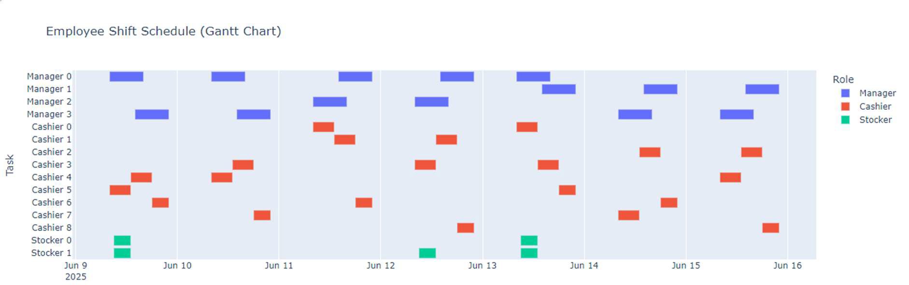
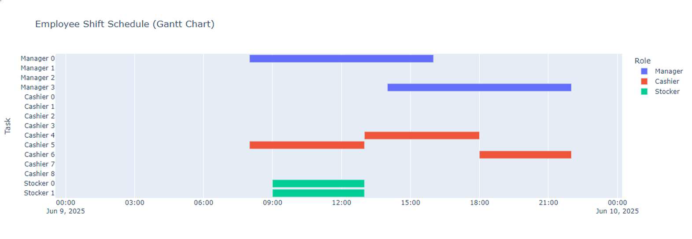

# Dollar Tree Workforce Operations

This project implements a **workforce scheduling optimization model** built with [Google OR-Tools](https://developers.google.com/optimization), using a **Mixed Integer Linear Programming (MILP)** framework.  

The goal is to **maximize labor efficiency** while ensuring compliance with **legal, social, and operational constraints**.  

---

## ⚙️ Tech Stack


---

## 📌 Features
- Optimized workforce scheduling for **managers, cashiers, and stockers** across a 7-day planning horizon.
- Incorporates **legal and social constraints** (max shifts per employee, weekend restrictions, unavailable days).
- Enforces **fairness in workload distribution** using auxiliary integer variables.
- Supports **predictive models** (e.g., turnover risk) to improve workforce planning.

---

## ⚙️ Model Formulation

### **Decision Variables**
- `m[i, d, s]`: Binary. Equals `1` if **manager i** works on **day d** and **shift s** (`0 = opening, 1 = closing`).
- `c[i, d, s]`: Binary. Equals `1` if **cashier i** works on **day d** and **shift s** (`0 = morning, 1 = afternoon, 2 = evening`).
- `st[i, d]`: Binary. Equals `1` if **stocker i** works on **day d**.
- Auxiliary integer variables for fairness:  
  - `max_cashier_shifts`, `min_cashier_shifts`  
  - `max_stocker_extra`, `min_stocker_extra`

---

### **Constraints**
- **Managers**
  - One manager per opening and closing shift per day.  
  - Maximum **5 shifts per week** per manager.  
  - Store manager (ID `0`) cannot work weekends.  
  - No double shifts per day.  

- **Cashiers**
  - Each shift covered by **exactly one cashier**.  
  - No more than one shift per cashier per day.  
  - IDs `0–4` not allowed in evening shifts.  

- **Stockers**
  - Both stockers must work **Fridays**.  
  - Stocker `0` unavailable on **Wednesdays and Thursdays**.  

- **Global Labor Limit**
  - Total labor hours ≤ **240 hours/week**  
    - Managers: 8h/shift  
    - Cashiers: 5h/shift  
    - Stockers: 4h/shift  

- **Fairness**
  - Minimize imbalance by constraining the difference between the most and least assigned shifts.  

---

### **Objective Function**
- **Maximize** total working hours assigned.  
- **Minimize** workload imbalance.  
- Achieve a **hybrid objective** of **efficiency and equity**.  

✅ The solution ensures **balanced labor distribution**, **legal compliance**, and **operational reliability**.  


---

### Weekly Schedule


### Daily Schedule


## 🚀 How to Run

### 1. Clone the repository
```bash
git clone git@github.com:RabeloIcaro/DollarTreeOperationsAndPredictiveModels.git
cd DollarTreeOperationsAndPredictiveModels

